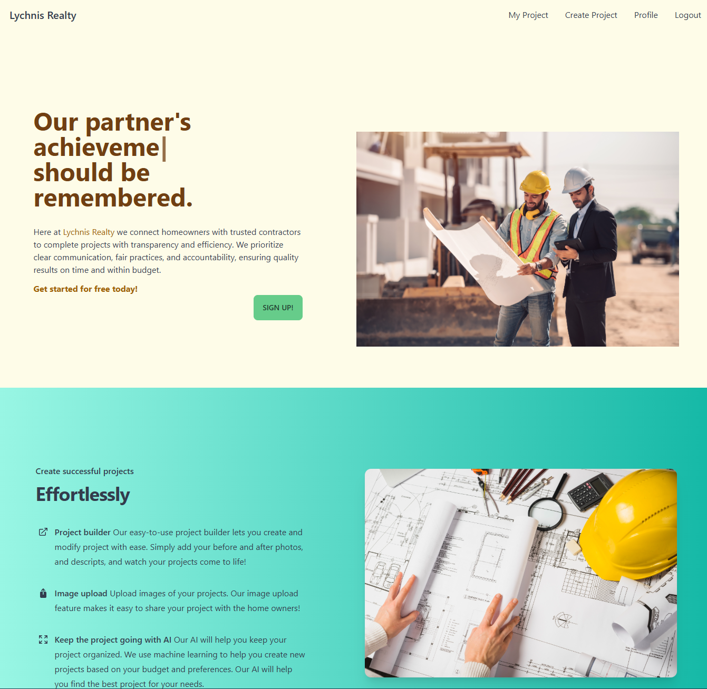

# MicroSaas Frontend



This is a [Next.js](https://nextjs.org/) project that is setup to work with an AWS CDK backend.

The frontend components are made with Tailwind UI, Daisy UI, and AWS Amplify UI Connected components.

The applcation is written fully in TypeScript and connects to the backend using the AWS Amplify JavaScript libraries.

## Getting Started

First, run the development server:

```bash
npm run dev
# or
yarn dev
# or
pnpm dev
```

Open [http://localhost:3000](http://localhost:3000) with your browser to see the result.

You can start editing the page by modifying `pages/index.tsx`. The page auto-updates as you edit the file.

[API routes](https://nextjs.org/docs/api-routes/introduction) can be accessed on [http://localhost:3000/api/hello](http://localhost:3000/api/hello). This endpoint can be edited in `pages/api/hello.ts`.

The `pages/api` directory is mapped to `/api/*`. Files in this directory are treated as [API routes](https://nextjs.org/docs/api-routes/introduction) instead of React pages.

This project uses [`next/font`](https://nextjs.org/docs/basic-features/font-optimization) to automatically optimize and load Inter, a custom Google Font.

Hui:

I have added 
.env.local
_app.tsx
auth.ts (newly created)
profile.tsx

## Environment Variables

The following environment variables are required:

- `NEXT_PUBLIC_region`: AWS region (e.g., us-east-1)
- `NEXT_PUBLIC_userpoolId`: Cognito User Pool ID
- `NEXT_PUBLIC_userPoolWebClientId`: Cognito User Pool Web Client ID
- `NEXT_PUBLIC_identityPoolId`: Cognito Identity Pool ID
- `NEXT_PUBLIC_bucket`: S3 bucket name for storage
- `NEXT_PUBLIC_appSyncURL`: AppSync GraphQL endpoint URL

For local development, create a `.env.local` file with these variables.
For production, set these in the AWS Amplify Console.
